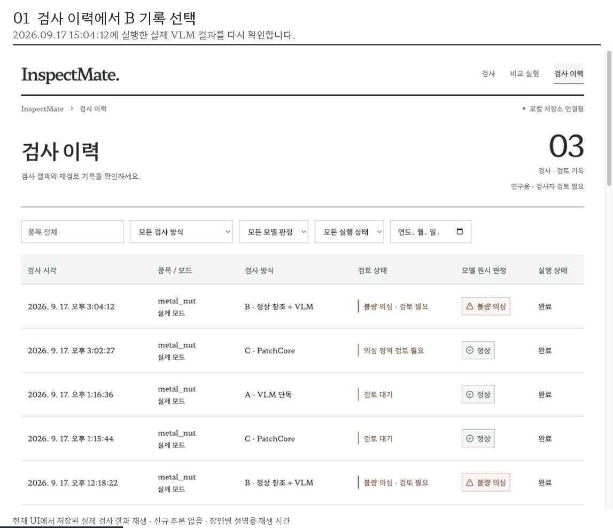
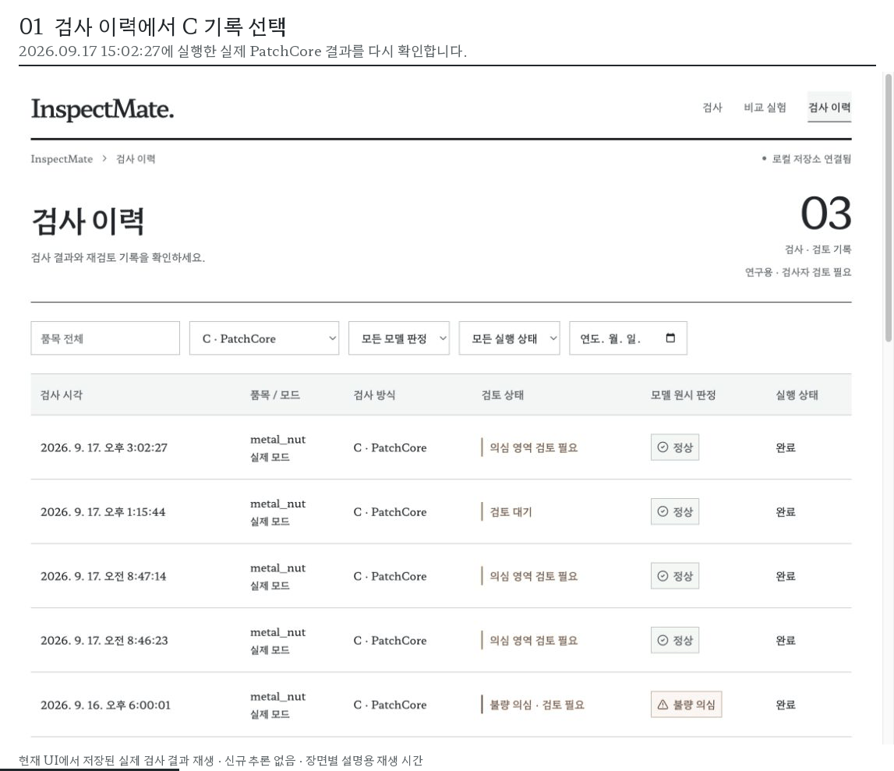
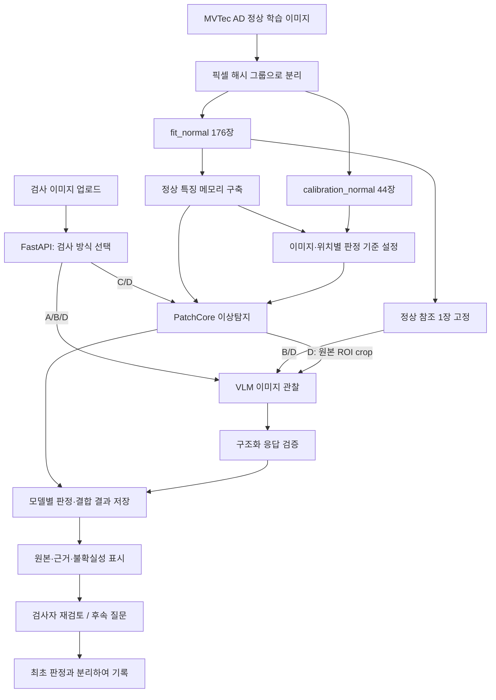
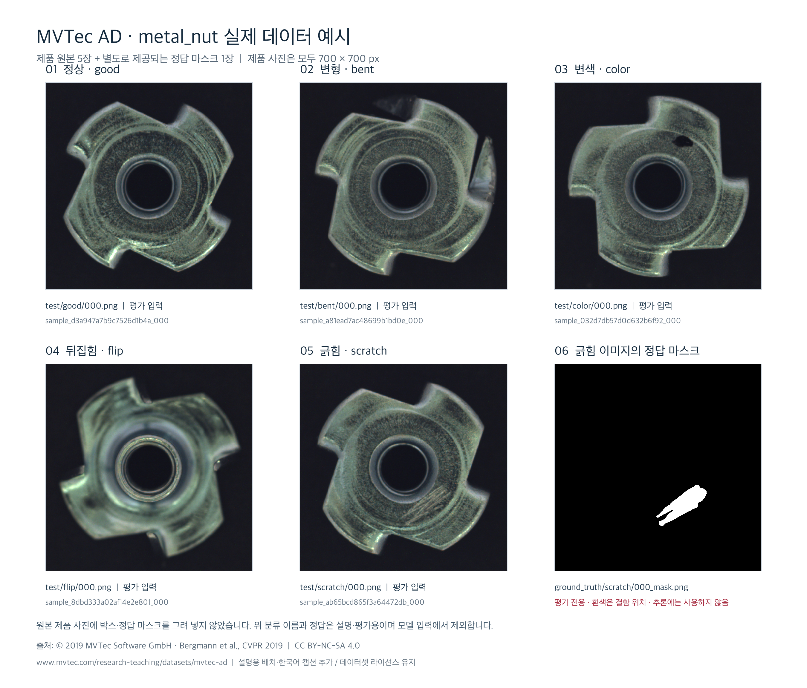

# InspectMate

**정상 참조와 비교하는 VLM 기반 제조 이상탐지·품질검사 어시스턴트**

금속 너트의 검사 사진을 정상 예시와 비교하고, 이상 점수·의심 영역·관찰 설명을 검사자가 확인할 수 있도록 만든 연구용 웹 애플리케이션입니다. “정상/불량” 한 줄 대신 **모델이 무엇을 관찰했고, 무엇을 확정하지 못했는지**를 기록합니다.

- **4가지 검사:** VLM 단독, 정상 참조 + VLM, PatchCore, PatchCore + VLM.
- **근거를 확인하는 화면:** 이미지 비교·확대, 이상 지도, 점수 분포, 후속 질문, 검사자 재검토와 이력.
- **현재 범위:** MVTec AD `metal_nut`의 실제 데이터 준비와 선택 사례 동작 확인. 전체 A/B/C/D 성능은 **미측정**이며, 제품 출하를 승인하는 시스템은 아닙니다.

React · TypeScript · Vite / FastAPI · Pydantic / SQLite / OpenAI Responses API / anomalib PatchCore

## 목차

- [실행 화면](#실행-화면)
- [모델과 전체 흐름](#모델과-전체-흐름)
- [미탐 사례와 검토 정책](#미탐-사례와-검토-정책)
- [설치와 실행](#설치와-실행)
- [데이터 준비](#데이터-준비)
- [비교 실험과 검증](#비교-실험과-검증)
- [문서와 라이선스](#문서와-라이선스)

## 실행 화면

최신 UI는 **검사 도록** 형식입니다. 왼쪽 목차로 이미지 비교·관찰 내용·검토 기록을 이동하고, **검사 이미지는 왼쪽, 정상 참조는 오른쪽**에 표시합니다. 정상 참조는 B/D에서만 나타납니다. 제목뿐 아니라 본문·메뉴·버튼·표·입력창에도 로컬 파일로 제공하는 **Hahmlet(함렡)** 서체를 적용했습니다.

아래 GIF는 **2026-09-17에 저장된 실제 B/C 검사 결과를 최신 UI에서 다시 열어 촬영한 편집본**입니다. 촬영 과정에서 신규 추론·후속 질문·검토 저장은 실행하지 않았습니다. 장면별 재생 시간은 원래 모델 응답 시간과 다릅니다.

### B · 정상 참조 + VLM



이력 선택 → 검사 원본과 정상 참조 비교 → **오른쪽 하단 긁힘 의심** 관찰 → 깊이·허용 기준의 불확실성 확인 → 검사자 검토 화면으로 이어집니다.

원검사: **2026-09-17 15:04:12 KST**, `gpt-4.1-mini-2025-04-14`, 불량 의심, API 경로 4.206초, 2,612토큰, 외부 요청 1회, 캐시 미사용. 이 값은 해당 과거 검사 한 건의 기록입니다.

### C · PatchCore의 정상 판정과 국소 이상 신호



이력 선택 → 원본과 검토 후보 → **모델 정상 / 의심 영역 재검토 필요** → 이미지 기준과 위치별 기준 비교 → 정상 점수 분포 확인으로 이어집니다.

원검사: **2026-09-17 15:02:27 KST**, `patchcore-resnet18`, 탐지 0.670초, 외부 요청 0회. 아래 [미탐 사례](#미탐-사례와-검토-정책)에서 정상으로 분류된 이유를 설명합니다.

[원검사 증빙](docs/evidence/execution-evidence.json) · [최신 UI 재생·촬영 증빙](docs/evidence/catalog-replay-evidence.json) · [GIF 이미지 출처와 이용 조건](docs/media/ATTRIBUTION.md)

## 모델과 전체 흐름

### 검사 방식 A/B/C/D

| 방식 | 입력과 동작 | 결과 | 외부 VLM 호출 |
|---|---|---|---|
| **A · VLM 단독** `vlm_only` | 검사 원본과 공통 관찰 기준을 VLM에 전달 | 판정, 관찰 위치·사실, 불확실성, 권장 조치 | 사용 |
| **B · 정상 참조 + VLM** `vlm_reference` | A에 fit 집합의 고정 정상 참조 1장 추가 | 정상 제품과 비교한 관찰 설명 | 사용 |
| **C · PatchCore** `patchcore` | 검사 특징을 저장된 정상 특징과 비교 | 이미지 이상 점수, 이상 지도, 검토 후보, 규칙 기반 설명 | 없음 |
| **D · PatchCore + VLM** `patchcore_vlm` | C를 실행하고 원본·정상 참조·실제 ROI crop을 VLM에 전달 | 탐지 판정, VLM 판정, 결합 판정을 별도로 저장 | 사용 |

ROI는 **검토 후보 영역**입니다. D에 전달하는 확대 이미지는 색칠된 이상 지도가 아니라 **원본에서 잘라낸 후보 부위**이며, 후보가 없어도 원본과 정상 참조로 VLM을 실행합니다.

### 데이터 준비부터 검토까지



실험 평가에서는 **예측을 먼저 저장한 뒤** 별도 평가기가 test 정답·마스크를 결합합니다. 결함 폴더명, 정답 라벨, 정답 마스크는 모델의 추론 입력에 넣지 않습니다. 서버는 이미지·메타데이터·검사·질문·재검토 기록을 로컬 파일과 SQLite에 보존합니다.

### 무엇을 학습했는가?

- **PatchCore:** 사전학습된 `resnet18`의 특징 추출기를 사용해 정상 사진 176장의 특징을 모으고, 대표 특징을 메모리로 저장했습니다. 별도 정상 사진 44장으로 이미지·위치별 기준을 설정했습니다. 신경망을 불량 라벨로 미세조정하는 방식은 아닙니다.
- **VLM:** OpenAI의 사전학습 모델을 API로 사용합니다. 이 프로젝트에서 금속 너트 이미지로 VLM을 학습하거나 미세조정하지 않았습니다. 정상 참조와 후보 확대 이미지, 관찰 기준을 요청에 제공하는 방식입니다.
- **검사 이미지 업로드:** 이미 준비된 모델로 추론하는 단계입니다. 업로드할 때마다 정상 특징을 다시 학습하지 않습니다.

현재 PatchCore 기본 설정은 CPU / `resnet18` / `layer2`·`layer3` / 256px / coreset 비율 0.1입니다. 정상 calibration 점수의 95백분위수로 이미지 기준, 위치별 점수의 99.5백분위수로 영역 표시 기준을 정합니다. **이상 점수는 불량 확률이나 흠집 크기가 아니며, 백분위수 설정이 실제 오탐률을 보장하지 않습니다.**

이 문서는 서비스 연결 구조를 설명합니다. 외부 VLM의 비공개 내부 레이어·비전 인코더 구조를 재현한 프로젝트는 아닙니다. 구현은 [architecture.md](architecture.md)와 [실험 프로토콜](experiment_protocol.md)에 정리했습니다.

## 미탐 사례와 검토 정책

### 긁힘이 있는데 왜 정상이라고 했는가?

`metal_nut/test/scratch/000.png`는 데이터셋에서 긁힘 불량으로 표시된 이미지입니다. 해당 C 검사에서 **후보 영역은 검출됐지만 이미지 전체 판정은 정상**이었습니다.

| 구분 | 측정값 | 기준 | 해석 |
|---|---:|---:|---|
| 이미지 전체 이상 점수 | 11.8609 | 12.0929 | 기준 이하 → 모델 원시 판정 정상 |
| 국소 후보 최대 점수 | 11.9096 | 10.9025 | 위치별 기준 초과 → 후보 영역 1개 |

이미지 판정과 영역 표시는 계산 방식·기준이 다르므로 동시에 발생할 수 있습니다. UI는 원시 결과를 유지하면서 **의심 영역 재검토 필요**라고 안내합니다. 이 사례에 맞춰 PatchCore 임계값을 낮추지 않았습니다.

초기 VLM도 같은 긁힘을 놓치거나 정상 변동으로 해석했습니다. 관찰한 흔적과 제품 허용 기준을 구분하도록 프롬프트를 보완한 뒤, 위 B 기록에서는 긁힘 의심과 불량 의심을 반환했습니다. **이미 본 사례를 다시 확인한 탐색 결과이며, 독립 평가에서 정확도가 향상됐다는 근거는 아닙니다.**

### 화면에서 구분하는 세 가지

1. **모델 원시 판정:** 정상, 불량 의심, 판단 보류. 실행 오류는 별도 실패 상태로 남깁니다.
2. **검사자 검토 상태:** 미검토, 검토 기록 있음, 추가 검토 필요. 설명 검토 완료는 제품 합격을 뜻하지 않습니다.
3. **제품 허용 기준:** 사진으로 알 수 없는 깊이·치수·출하 기준을 임의로 추정하지 않습니다.

D는 두 모델이 모두 정상 또는 모두 불량 의심으로 일치할 때 해당 결과를 채택하고, 나머지는 판단 보류로 남깁니다. 후속 질문은 이미지를 다시 관찰할 수 있지만 **최초 검사 판정과 실험 예측을 덮어쓰지 않습니다.**

## 설치와 실행

### 1. 의존성 설치

저장소를 내려받은 뒤 프로젝트 루트에서 실행합니다. Python **3.11 또는 3.12**, Node **20 계열의 20.19 이상 또는 22.12 이상**, `uv`, `npm`이 필요합니다. 의존성은 `uv.lock`과 `frontend/package-lock.json`으로 고정합니다.

```bash
git clone https://github.com/BaekJiHeon/InspectMate.git
cd InspectMate
uv sync --locked --python 3.11
cd frontend
npm ci
cd ..
cp .env.example .env
```

이미 `.env`가 있다면 마지막 복사 명령 대신 기존 파일을 유지하세요. C/D를 사용하려면 선택 의존성을 추가합니다. GPU는 필수가 아닙니다.

```bash
uv sync --locked --python 3.11 --extra detector
```

**저장소에는 전체 데이터셋, 정상 특징 메모리, 업로드 이미지, SQLite DB, API 키가 포함되지 않습니다.** B는 정상 참조 데이터, C/D는 데이터와 PatchCore 준비가 추가로 필요합니다. 절차는 아래 [데이터 준비](#데이터-준비)를 따르세요.

### 2. 로컬 서버 시작

```bash
bash scripts/dev.sh
```

- 웹 화면: [http://127.0.0.1:5173](http://127.0.0.1:5173)
- API 문서: [http://127.0.0.1:8740/docs](http://127.0.0.1:8740/docs)
- 설정 상태 확인: `uv run --no-sync inspectmate status`
- 종료: 실행한 터미널에서 `Ctrl+C`

개발 서버는 로컬 주소에만 바인딩합니다. 단일 사용자·단일 백엔드 프로세스를 기준으로 만들었습니다.

<details>
<summary>터미널 두 개에서 각각 실행하기</summary>

백엔드 — 프로젝트 루트:

```bash
uv run --no-sync uvicorn inspectmate.api:app --host 127.0.0.1 --port 8740
```

프런트엔드 — 별도 터미널:

```bash
cd frontend
npm run dev
```

`--no-sync`는 이미 설치한 detector 선택 의존성을 유지합니다. 의존성을 변경할 때는 먼저 `uv sync --locked` 또는 `uv sync --locked --extra detector`를 실행하세요.

</details>

### 3. VLM을 사용할 때만 서버 설정

프로젝트 루트의 **서버용 `.env`**에 설정합니다. 브라우저 코드나 `VITE_*` 변수에는 키를 넣지 않습니다.

```dotenv
OPENAI_API_KEY=발급받은_API_키
OPENAI_MODEL=gpt-4.1-mini-2025-04-14
ALLOW_EXTERNAL_API=true
```

서버 재시작 후, 화면에서 이번 실행의 **이미지 전송·유료 호출 동의**를 선택해야 A/B/D를 실행할 수 있습니다. 검사 원본과 방식에 따른 정상 참조·후보 확대 이미지가 외부 API에 전달됩니다. C는 외부 API를 호출하지 않습니다.

기본 요청 한도는 백엔드 프로세스당 50회(재시도 포함), 토큰 한도는 100,000입니다. 재시작·별도 CLI 실행은 새 예산 세션입니다. 단가를 설정하지 않으면 비용은 **미산정**으로 표시하며, 앱의 한도·추정액은 제공자 청구의 절대 상한이 아닙니다. 설정 항목은 [.env.example](.env.example)을 참고하세요.

### 4. 화면 사용 순서

1. 검사 방식과 실행 모드를 확인합니다.
2. PNG/JPG/WEBP 제품 사진 **1장, 최대 10MB**를 검사 이미지에 드래그하거나 업로드합니다.
3. B/D는 자동으로 표시되는 정상 참조를 확인합니다. A/B/D는 전송 동의를 선택합니다.
4. **검사 실행**을 누릅니다. 실행할 수 없으면 버튼 아래에 이유가 표시됩니다.
5. 모델 판정·관찰·불확실성·후보 영역을 확인하고 검사자 검토를 남깁니다.
6. 검사 이력에서 저장 결과를 다시 열거나 원시 JSON을 내려받습니다.

키와 데이터 없이 화면 흐름을 보려면 **데모 모드 → 데모 샘플 불러오기 → 검사 실행**을 사용합니다. 데모는 전용 도형과 명시적 데모 응답을 사용하며 실제 제품 분석이나 성능 평가가 아닙니다. API 실패를 데모 성공으로 바꾸지 않습니다.

## 데이터 준비

### 1. MVTec AD 다운로드와 폴더 배치

[MVTec AD 공식 페이지](https://www.mvtec.com/research-teaching/datasets/mvtec-ad)에서 이용 조건을 확인하고 `metal_nut` 데이터를 내려받아 압축을 해제합니다. 원본의 `license.txt`와 `readme.txt`도 보존하세요.

```text
/path/to/mvtec_ad/metal_nut/
├── train/good/*.png
├── test/good/*.png
├── test/<defect-type>/*.png
└── ground_truth/<defect-type>/*_mask.png
```

프로젝트에서 확인한 구성은 정상 학습 **220장**, test **115장**(정상 22장 / 이상 93장), 정답 마스크 **93장**입니다. 개발 당시 다운로드 출처와 체크섬 확인 범위는 [data_card.md](data_card.md)에 남겼습니다.



제품 사진 5장과 별도의 정답 마스크를 설명용으로 배치한 갤러리입니다. 마지막 마스크는 모델 출력이나 검사 입력이 아닙니다. © 2019 MVTec Software GmbH, CC BY-NC-SA 4.0. [출처와 편집 내용](docs/media/ATTRIBUTION.md).

### 2. 데이터 목록과 분할 고정

```bash
uv run --no-sync inspectmate manifest --root /path/to/mvtec_ad --category metal_nut
```

`--root`는 `metal_nut`의 **상위 폴더**입니다. `.env`의 `MVTEC_ROOT`에 같은 경로를 설정하면 생략할 수 있습니다.

- 정상 학습 데이터를 고유 RGB 픽셀 해시 그룹, seed 42 기준으로 **fit 176장 / calibration 44장**으로 분리합니다.
- 정상 참조는 fit 집합에서 **1장 고정** 선택합니다. test에서 고르지 않습니다.
- train/test 중복을 차단하고, test 정답·마스크를 추론용 목록과 분리합니다.
- 기존 manifest는 덮어쓰지 않습니다. 다른 프로토콜은 별도 `INSPECTMATE_DATA_DIR`에서 준비하세요.

### 3. C/D용 정상 특징 메모리 준비

```bash
uv run --no-sync inspectmate detector-fit --category metal_nut
uv run --no-sync inspectmate detector-predict /path/to/query.png --category metal_nut
```

첫 명령은 정상 특징 수집 → coreset 메모리 구축 → 별도 정상 calibration → 산출물 저장 순서로 진행됩니다. 최초 실행에는 사전학습 가중치 다운로드가 필요할 수 있으며 특징을 모을 충분한 RAM이 필요합니다. 준비 후 앱의 C/D 방식에서 사용합니다.

업로드에는 **표시를 덧그리지 않은 제품 원본**을 사용합니다. 정답 마스크, 박스·설명이 합성된 그림은 검사 입력이 아닙니다. [사용법](START_HERE.md)과 [데이터 카드](data_card.md)에 데이터 역할을 정리했습니다.

## 비교 실험과 검증

### 동일 이미지에서 A/B/C/D 비교

화면의 **비교 실험**에서 방식·샘플 수를 선택하고 호출 수를 먼저 확인할 수 있습니다. CLI도 `--execute`가 없으면 실행 계획만 출력합니다.

```bash
uv run --no-sync inspectmate experiment --methods vlm_only vlm_reference --limit 10
```

실제 유료 VLM 호출을 포함한 실행:

```bash
uv run --no-sync inspectmate experiment --methods vlm_only vlm_reference --limit 10 --execute --consent-external
```

전체 데이터 실행은 `--full`, C/D 포함은 `--methods`에 `patchcore patchcore_vlm`을 추가합니다. 데이터·모델 준비와 호출 예산을 먼저 확인하세요. 기본 실험은 `exploratory`이며, 이미 결과를 보고 조정한 사례를 독립적인 최종 평가로 소개하지 않습니다.

완료된 `data/experiments/<id>`에는 `predictions.jsonl`, `metrics.json`, `comparison.csv`, `report.md`, `run_config.json`이 생성됩니다. 실패·취소·판단 보류를 누락하지 않고 정답과 예측의 2×4 교차표, 자동 판정 비율, 불량 통과율, 정상 오탐률 등을 함께 확인합니다.

```bash
uv run --no-sync inspectmate evaluate data/experiments/<id>
uv run --no-sync inspectmate report data/experiments/<id>
```

후속 질문과 검사자 메모는 최초 예측을 수정하지 않습니다. 캐시 조회를 새 추론 시간으로 집계하지 않으며, 단일 검사에서 **화면 대기 취소**는 이미 전송한 호출을 회수하지 않습니다.

### 코드 검사 재실행

프로젝트 루트에서:

```bash
uv run --no-sync pytest -q
uv run --no-sync ruff check backend tests
cd frontend
npm run build
```

테스트는 외부 유료 호출 없이 실행하도록 작성되어 있습니다. detector 의존성을 설치하지 않은 경우 anomalib smoke 검사는 건너뜁니다. 프로그램 테스트와 모델 정확도 평가는 별개입니다.

**2026-09-17 GitHub 게시 준비 시 재검증:** pytest **35 passed**(deprecation warning 4건), Ruff 통과, `uv pip check`의 97개 패키지 호환 확인, TypeScript·Vite 빌드 통과. 이 검증에서는 유료 VLM을 호출하지 않았습니다. 아래 과거 실제 모델 실행·UI 재생 기록과 구분합니다.

| 확보한 근거 | 아직 확인하지 않은 범위 |
|---|---|
| 데이터 분리·정답 유출 방지·요청 동의·응답 구조·저장·평가 계산의 코드 검증 기록 | 새로운 현장 이미지에서의 탐지·설명 정확도 |
| 실제 정상 데이터로 PatchCore 특징 메모리와 기준 설정 | 다른 품목·조명·카메라에 대한 일반화 |
| 선택한 B/C/D 사례의 실제 실행 및 저장 결과 | 공식 test 115장의 현재 버전 전체 A/B/C/D 비교 성능 |
| 최신 UI에서 B/C 저장 결과 재조회와 검토 화면 확인 | 모든 환경의 브라우저 회귀·접근성·장시간 운영 검증 |

과거 실행 시점별 기록은 [verification.md](verification.md), 전체 비교 평가 상태는 [reports/current/report.md](reports/current/report.md)에 있습니다. GIF는 기능 설명과 오류 분석 근거이며, 탐지 정확도·검사 시간 절감·생산성 향상의 실적을 뜻하지 않습니다. 알려진 긁힘 사례에서 프롬프트를 개선했으므로 성능 주장을 하려면 조정에 쓰지 않은 별도 데이터로 검증해야 합니다.

## 문서와 라이선스

### 세부 문서

| 문서 | 내용 |
|---|---|
| [START_HERE.md](START_HERE.md) | 화면 사용과 검사 방식별 표시 항목 |
| [architecture.md](architecture.md) | 프런트엔드·API·저장소·모델 경계와 파일별 책임 |
| [experiment_protocol.md](experiment_protocol.md) | 데이터 분리, 참조, PatchCore 기준, 비교·평가 원칙 |
| [data_card.md](data_card.md) | 데이터 출처·구성·다운로드 검증 범위 |
| [verification.md](verification.md) | 날짜별 코드·실제 호출 검증 기록 |
| [limitations.md](limitations.md) | 프로토타입 제약과 후속 검증 과제 |
| [원검사 증빙](docs/evidence/execution-evidence.json) / [재생 증빙](docs/evidence/catalog-replay-evidence.json) | GIF에 사용한 과거 실제 결과와 신규 추론 없는 촬영 기록 |

### 이용 조건을 구분합니다

| 대상 | 조건 |
|---|---|
| 프로젝트 코드 | [MIT License](LICENSE) |
| MVTec AD 데이터·마스크 및 이를 포함한 GIF·예시 이미지 | **CC BY-NC-SA 4.0**. 비상업적 이용 등 원데이터 조건 적용. [출처·편집 내용](docs/media/ATTRIBUTION.md) 참고 |
| Hahmlet 폰트 | [SIL Open Font License 1.1](frontend/public/fonts/Hahmlet-OFL.txt). 저장소에 라이선스 동봉 |
| 사전학습 가중치·외부 API·기타 의존성 | 각 공급자의 라이선스·이용약관 적용 |

코드의 MIT 라이선스가 데이터나 화면 속 제품 사진을 재허가하지 않습니다. 전체 데이터셋과 학습 산출물은 별도로 준비해야 합니다.

공식 참고: [MVTec AD](https://www.mvtec.com/research-teaching/datasets/mvtec-ad) · [OpenAI 이미지 입력](https://developers.openai.com/api/docs/guides/images-vision) · [Structured Outputs](https://developers.openai.com/api/docs/guides/structured-outputs) · [anomalib PatchCore](https://anomalib.readthedocs.io/en/latest/markdown/guides/reference/models/image/patchcore.html) · [Hahmlet](https://github.com/hyper-type/hahmlet)
