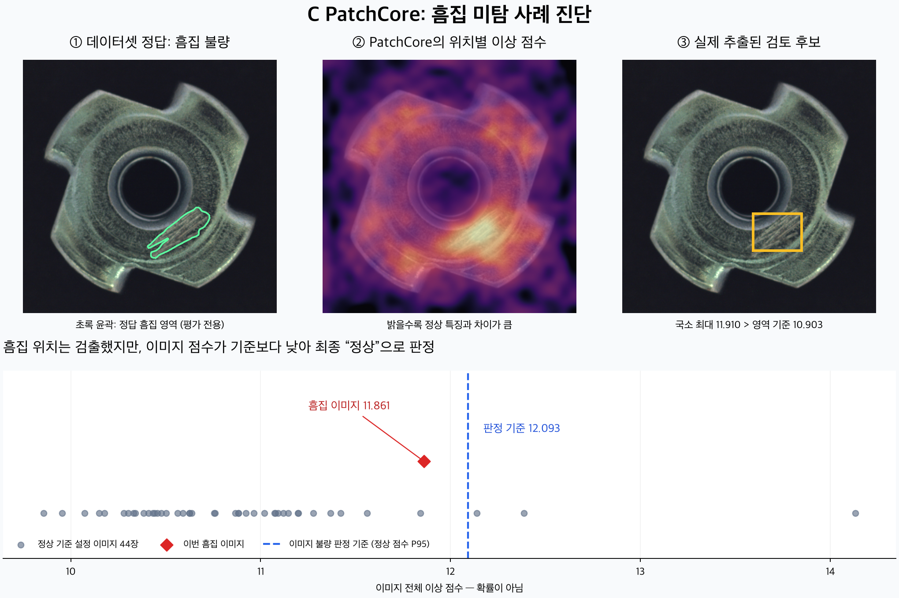

# C PatchCore 흠집 미탐 검토

## 결론

이번 입력은 데이터셋에서 `scratch` 불량으로 표시된 이미지다. 저장된 업로드 이미지와 원본의 RGB 픽셀이 완전히 일치한다. 기존 모델로 재현한 결과도 저장된 결과와 같다. 의심 위치는 검출했지만 최종 이미지 점수가 판정 기준을 넘지 못한 **미탐(false negative)** 이다.

## 현재 C가 하는 일

1. 정상 이미지 176장에서 사전 학습된 ResNet18로 특징을 추출한다. 신경망 가중치를 다시 학습하는 방식은 아니다.
2. 입력을 256×256으로 변환하고 layer2·layer3 특징을 합쳐 32×32 위치마다 384차원 특징을 만든다.
3. 정상 특징 180,224개에서 대표 18,022개를 저장한다. 이것이 정상 메모리다.
4. 별도 정상 44장으로 이미지 점수의 95백분위수와 위치 점수의 99.5백분위수를 계산한다. 테스트 불량 사진·정답 마스크는 이 과정에 사용하지 않는다.
5. 검사할 때 각 위치의 특징과 정상 메모리 사이의 최근접 거리를 구한다. 가장 의심스러운 위치의 거리와 그 정상 이웃들을 이용해 이미지 전체 점수를 만든다. 전체 위치 점수의 단순 평균이 아니다.
6. 별도로 위치 점수를 확대·평활화하여 이상 지도를 만들고, 위치 기준을 넘는 영역에서 검토 후보 박스를 추출한다.
7. 최종 C 판정은 이미지 점수만 기준과 비교한다. 검토 후보 박스가 있다고 자동으로 불량으로 바뀌지는 않는다. C에는 VLM/API 호출이 없다.

## 이번 결과

| 구분 | 실제 점수 | 기준 | 결과 |
|---|---:|---:|---|
| 이미지 최종 판정 | 11.860912 | 12.092904 | 기준 미초과 → 정상 |
| 위치별 의심 영역 | 최대 11.909557 | 10.902511 | 기준 초과 → 박스 표시 |

두 점수는 계산 방법이 다르므로 서로 교환해 비교할 수 없다. 점수는 불량 확률이나 흠집의 물리적 크기가 아니다. 박스는 검토 후보이고 정답 마스크가 아니다.

정상 기준 설정 44장 중 3장은 이 흠집 사진보다 이미지 점수가 높다. 현재 특징·점수로는 정상 표면의 변동과 이번 흠집을 충분히 분리하지 못했다. 이것이 확인 가능한 모델의 한계다. 정상 점수 P95를 쓴다고 실제 정상 오탐률 5%가 보장되는 것은 아니다.

## 세부 구현 검증

설치된 anomalib 2.3.1을 독립 재현한 결과: 가중치 적용 전 최대 패치 거리 12.130113602, 정상 이웃 9개에 의한 가중치 0.977807192, 최종 점수 11.860912323. layer2는 128×32×32, layer3는 256×16×16이다. Gaussian blur는 이상 지도에만 적용되므로 이를 이미지 정상 판정의 직접 원인이라고 설명할 수 없다. 가중치 전 점수를 현재의 가중치 후 기준과 비교하는 것도 유효한 해결책이 아니다.

700×700에서 256×256으로 축소하는 점, 32×32 특징 해상도, 범용 이미지로 사전 학습된 ResNet18의 표현력이 흠집 구분에 불리할 **가능성**은 있다. 어느 요소가 주원인인지는 대조 실험 없이 확정할 수 없다.

## 개선 우선순위

1. 사용자 화면에서 이미지 기준 미초과와 국소 검토 후보 존재를 동시에 명시한다. 검토 보류 규칙을 추가한다면 기존 C 판정과 구분하여 평가한다.
2. 현재 모델과 기준을 고정한 전체 테스트에서 흠집 검출률·정상 오탐률·다른 결함별 검출률을 확인한다. 이번 한 장으로 전체 정확도를 주장할 수 없다.
3. 별도 개발 실험으로 입력 해상도, 특징 추출기, 타일 방식 등을 비교한다. 각 설정마다 정상 메모리와 기준을 다시 만든다.
4. 이미 확인한 테스트 이미지 한 장을 맞히도록 기준을 낮추는 방식은 평가 데이터에 맞춘 조정이므로 성능 개선의 근거로 삼지 않는다.

검토 과정에서 모델·임계값·앱 코드·기존 판정 기록을 변경하지 않았고 외부 API도 호출하지 않았다. 전체 테스트는 이번 검토 범위에 포함하지 않았다.

## 근거

- 검사 ID: `7413148ebdfc47bbb25d24c7916f73ec`
- 모델 설정 해시: `54410d28da82bfcf2139aacfecd7020951a0a5fd161106724596ac54ebe8e3dc`
- `backend/inspectmate/detector.py`: 정상 메모리, 기준 계산, ROI 및 최종 판정
- `data/detectors/metal_nut/metadata.json`: 실제 학습 설정과 정상 기준 설정 점수
- `data/images/7413148ebdfc47bbb25d24c7916f73ec.npz`: 저장된 실제 이상 지도
- [anomalib 공식 PatchCore 문서](https://anomalib.readthedocs.io/en/latest/markdown/guides/reference/models/image/patchcore.html)
- [MVTec AD 데이터셋](https://www.mvtec.com/research-teaching/datasets/mvtec-ad), 이미지 출처·라이선스는 프로젝트 data_card.md 참조
